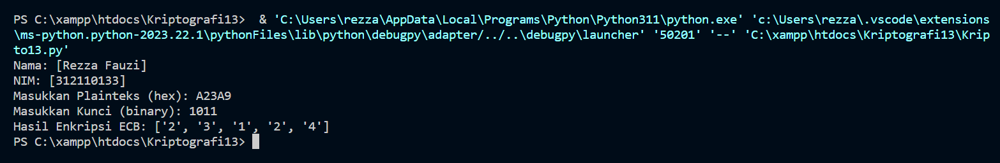

# Kriptografi Pertemuan 13


## Profil
| #               | Biodata                      |
| --------------- | ---------------------------- |
| **Nama**        | Rezza Fauzi                  |
| **NIM**         | 312110133                    |
| **Kelas**       | TI.21.A.1                    |
| **Mata Kuliah** | Kriptografi                  |


### Penjelasan
**1. Hex to Bin Function:**
```
def hex_to_bin(hex_string):
    return bin(int(hex_string, 16))[2:]
```
Fungsi ini mengonversi string heksadesimal menjadi biner.<br>

**2. Bin to Hex Function:**
```
def bin_to_hex(bin_string):
    return hex(int(bin_string, 2))[2:]
```
Fungsi ini mengonversi string biner menjadi heksadesimal.<br>

**3. Encrypt ECB Function:**
```
def encrypt_ecb(plaintext_hex, key_bin):
    # ...
```
Fungsi ini melakukan enkripsi ECB pada plaintext dalam format heksadesimal dengan menggunakan kunci biner.
* Step 4: Pisahkan per blok 4 bit.
* Step 5-6: XOR dan geser tiap blok.
* Step 7: Konversi hasil XOR ke hexadecimal.<br>

**4. Input User:**
```
plainteks_hex = input("Masukkan Plainteks: ").upper()
kunci_bin = input("Masukkan Kunci: ")
```
Program meminta input dari pengguna berupa plaintext dalam format heksadesimal dan kunci dalam format biner.<br>

**5. Enkripsi ECB:**
```
hasil_enkripsi_ecb = encrypt_ecb(plainteks_hex, kunci_bin)
```
Panggilan fungsi untuk melakukan enkripsi ECB.<br>

**6. Output Hasil Enkripsi:**
```
print("Hasil enkripsi ECB:", hasil_enkripsi_ecb)
```
Menampilkan hasil enkripsi ECB dalam format heksadesimal.


<h2>OutPut </h2>



<p>
 TERIMA KASIH.
